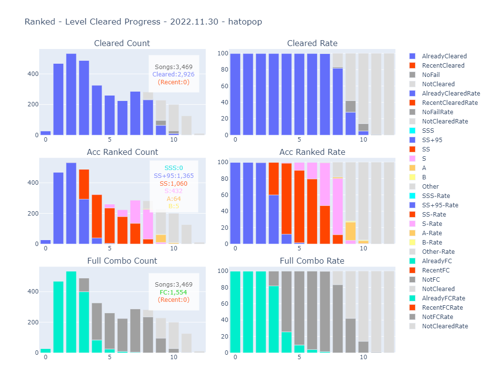

# MyBSAnalytics_Lite

The [Google Colab Notebook](https://colab.research.google.com/github/hatopopvr/MyBSAnalytics_Lite/blob/main/MyBSAnalytics_Lite_En.ipynb)
 to analyze your [ScoreSaber](https://scoresaber.com/)'s Ranked scores data.

<b>Data</b>
- Score Data from ScoreSaber Public API - [doc](https://docs.scoresaber.com/)  
- Ranked Map Data from RankedMapData by rakkyo150 - [RankedMapData](https://github.com/rakkyo150/RankedMapData)  
- Various ScoreSaber Rankings Data by rynan4818 - [ScoreSaberRanking
](https://github.com/rynan4818/ScoreSaberRanking) 
- Cover Image form - https://cdn.scoresaber.com/covers/{hash}.png  

<b>Author</b>
- hatopop ([@hatopop_vr](https://twitter.com/hatopop_vr))

<b>Caution</b>
- If you would like me to add a default value for the timezone, please mentions me on Twitter.
