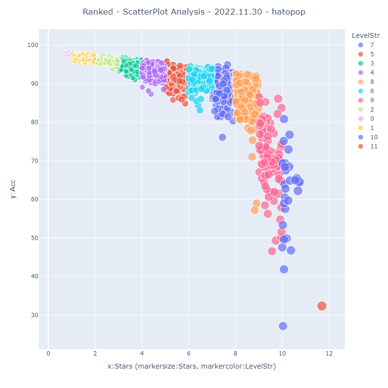

# MyBSAnalytics_Lite

The [Google Colab Notebook](https://colab.research.google.com/github/hatopopvr/MyBSAnalytics_Lite/blob/main/MyBSAnalytics_Lite_En.ipynb)
 to analyze your [ScoreSaber](https://scoresaber.com/)'s Ranked scores data.

## tools
### Scatter Plot

### Cleared Progress

## how to use

1. When the [notebook](https://colab.research.google.com/github/hatopopvr/MyBSAnalytics_Lite/blob/main/MyBSAnalytics_Lite_En.ipynb)  opens, input information below.
 - `player_id` : enter the ScoreSaber PlayerID.
 

 
2. Press the `Runtime` tab, then Press the `Run All` or `Restart and Run All` button to get the results.  
  (Please run it despite the warning.)

## Data
- Score Data from ScoreSaber Public API - [doc](https://docs.scoresaber.com/)  
- Ranked Map Data from RankedMapData by rakkyo150 - [RankedMapData](https://github.com/rakkyo150/RankedMapData)  
- Various ScoreSaber Rankings Data by rynan4818 - [ScoreSaberRanking
](https://github.com/rynan4818/ScoreSaberRanking) 
- Cover Image form - https://cdn.scoresaber.com/covers/{hash}.png  

## Author
- hatopop ([@hatopop_vr](https://twitter.com/hatopop_vr))

## Caution
- If you would like me to add a default value for the timezone, please mentions me on Twitter.
